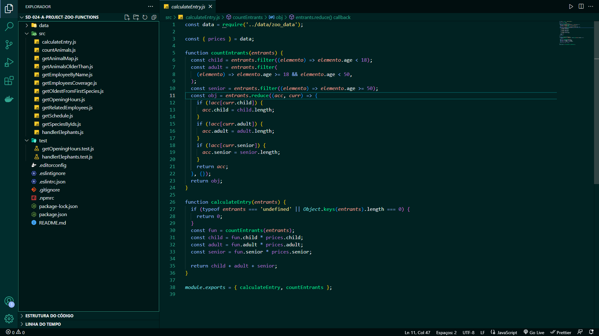

<h1 align="center">Projeto - Zoo Functions</h1>

<strong>🧑‍💻 O que foi desenvolvido</strong>
 

Sabendo das suas habilidades com `ES6`, `Higher Order Functions` e testes, a prefeitura da cidade me deu uma importante missão: organizar as informações do zoológico! 🐘

Eu fui responsável por desenvolver funções que buscam informações sobre os animais do zoológico como: espécie e local de origem. Além disso, também busquei dados sobre as pessoas que colaboram com a manutenção e cuidado do zoológico. 🧑‍🌾

E não para por aí! 🤩

Eu aprendi sobre a importância de ter uma mentalidade orientada a testes, e também já sei como a implementação de testes contribui para a escrita de códigos mais confiáveis e com boa performance.

A sequência dos requisitos desse projeto foi disposta de forma a me proporcionar a experiência de entender na prática como o desenvolvimento orientado a testes ajuda a garantir um código de qualidade. Para isso, implementei testes para funções já existentes, percebendo os casos de uso da sua aplicação e garantindo que ela está funcionando da maneira correta! 🚀

 

